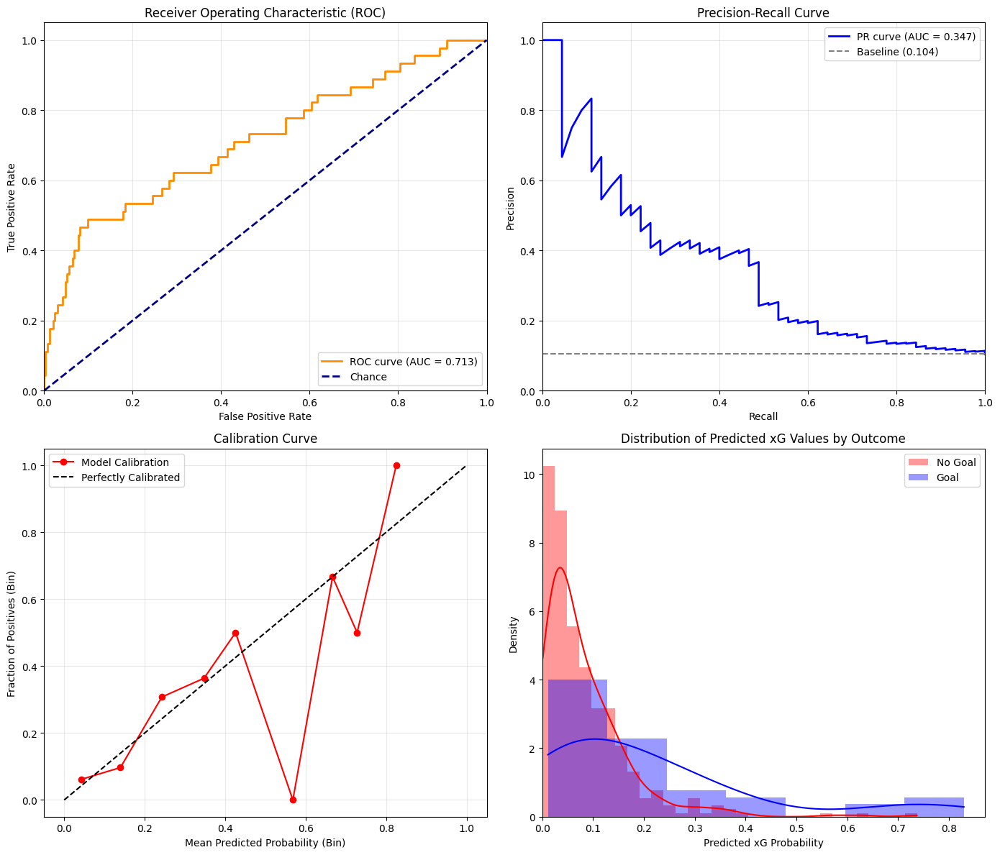
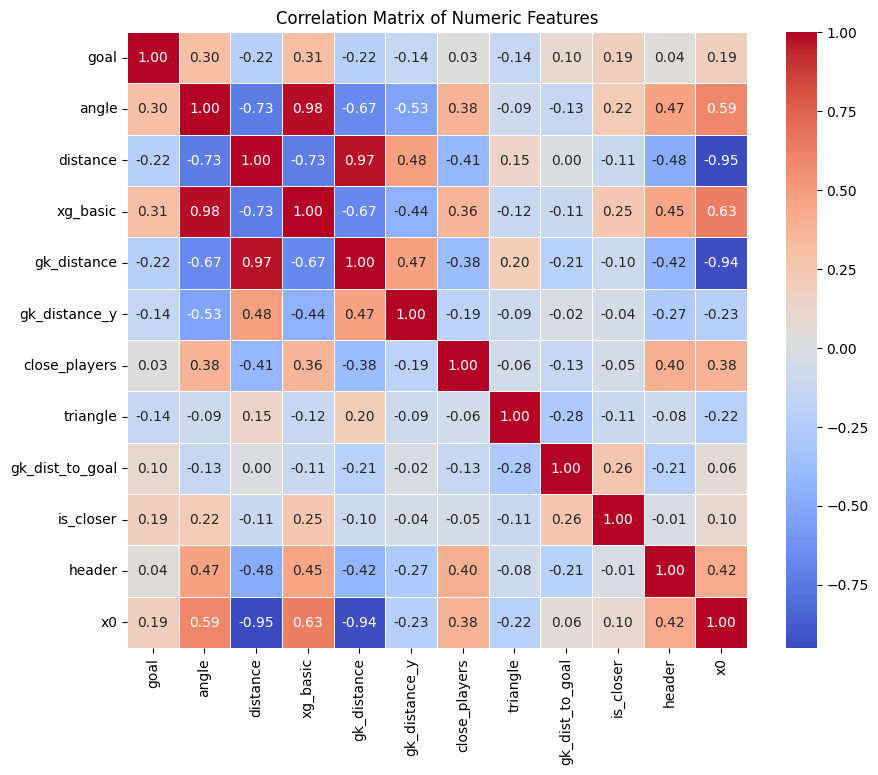

# Expected Goals (xG) Model with Tracking Data (ISL 21/22)

## Project Overview

This project implements an Expected Goals (xG) model for football (soccer) shots, leveraging not only standard event data (like shot location and angle) but also incorporating player tracking data to account for defensive pressure and goalkeeper positioning. The model is trained on the StatsBomb Open Data for the Indian Super League (ISL) 2021/2022 season, which uniquely includes event-linked tracking information.

The primary goal is to build a more context-aware xG model compared to simpler geometric models and to provide detailed Exploratory Data Analysis (EDA) and visualizations to understand the data and model behavior.

## Key Features

*   **Dataset:** Utilizes StatsBomb Open Data for ISL 2021/2022.
*   **Data Integration:** Combines standard event data with player tracking data frames linked to shot events.
*   **Feature Engineering:**
    *   Calculates standard geometric features (distance to goal, angle to goal).
    *   Includes a baseline logistic regression xG model (`xg_basic`).
    *   Engineers features from tracking data:
        *   Distance from shooter to Goalkeeper (absolute and y-axis).
        *   Distance from Goalkeeper to the goal center.
        *   Binary: Whether the ball is closer to the goal than the GK.
        *   Number of opponents near the shooter (< 3m).
        *   Number of opponents inside the shooting triangle (shooter-posts).
    *   Includes shot type features (e.g., Header).
*   **Modeling:** Employs a Keras/TensorFlow Sequential Neural Network for xG prediction.
*   **EDA & Visualization:** Includes extensive EDA plots using Matplotlib, Seaborn, and MplSoccer to explore data distributions, feature relationships, and correlations.
*   **Evaluation:** Assesses model performance using ROC AUC, Precision-Recall AUC, Brier Score, Log Loss, and Calibration Plots.
*   **Qualitative Analysis:** Visualizes specific high/low xG shots on a pitch, showing player positions from tracking data to provide context.
*   **Reproducibility:** Uses fixed random seeds for consistent results.
*   **Output:** Saves generated plots to a dedicated directory (`xg_model_plots_isl/`).

## Dataset

This project relies on the publicly available **StatsBomb Open Data**. Specifically, it uses:
*   **Competition:** Indian Super League (Competition ID: 1238)
*   **Season:** 2021/2022 (Season ID: 108)

This dataset is crucial because it's one of the few openly available datasets that includes event-linked player tracking data for an entire season.

You can find more information about StatsBomb Open Data [here](https://statsbomb.com/resource-centre/).

## Methodology

The core steps undertaken in the Jupyter Notebook (`Enhanced_xG_Tracking_ISL.ipynb`) are:

1.  **Data Loading:** Load match data, event data, and tracking data for the specified ISL season using `mplsoccer.Sbopen`.
2.  **Filtering:**
    *   Isolate 'Shot' events.
    *   Filter for 'Open Play' shots.
    *   Filter shots to include only those where the opponent Goalkeeper's position was available in the corresponding tracking data frame.
3.  **Feature Engineering:** Calculate geometric, basic xG, and tracking-based features as listed above.
4.  **Exploratory Data Analysis (EDA):** Visualize feature distributions, counts, correlations, and spatial patterns.
5.  **Data Preparation:** Select final features, split data into training, validation, and test sets (70/15/15 split, stratified by goal outcome), and scale numerical features using `StandardScaler`. Original indices are preserved for later analysis.
6.  **Model Training:** Define and train a shallow Keras Sequential neural network, optimizing Mean Squared Error (Brier Score) with early stopping based on validation loss.
7.  **Model Evaluation:** Evaluate the trained model on the unseen test set using various metrics (ROC AUC, PR AUC, Brier, LogLoss) and plots (ROC, PR, Calibration, Predicted Probability Distributions).
8.  **Qualitative Analysis:** Select example shots (high-xG misses, low-xG goals) from the test set and visualize them on a pitch, including player positions from tracking data.
9.  **Plot Saving:** Automatically save all generated plots to the `xg_model_plots_isl/` directory.

## Key Visualizations & Results

The model achieves reasonable performance in distinguishing goals from non-goals, significantly outperforming random chance. Tracking-based features provide additional context beyond simple shot location.


**Example: Evaluation Metrics Plot**

*(Caption: Test set evaluation showing ROC, Precision-Recall, Calibration, and Predicted xG Distribution. AUC ~0.71, PR AUC ~0.35. Calibration shows some overconfidence at higher probabilities.)*

**Example: Qualitative Shot Analysis**

*(Caption: Example of a goal scored despite a very low predicted xG (0.013), highlighting the difficult nature of the finish likely due to defensive pressure/positioning captured by the tracking data.)*

**Example: Feature Correlation**

*(Caption: Correlation matrix showing relationships between engineered features and the goal outcome.)*

## Installation

1.  Clone this repository:
    ```bash
    git clone https://github.com/Abbasali17/ExpectedGoals_xG.git
    cd your-repo-name
    ```
2.  Install the required Python libraries. It's recommended to use a virtual environment.
    ```bash
    pip install pandas numpy matplotlib seaborn mplsoccer statsmodels tensorflow scikit-learn
    ```
    *(Tested with Python 3.9/3.10)*

## Usage

1.  Ensure all dependencies listed above are installed.
2.  Run the Jupyter Notebook:
    *   `xG_code.ipynb`
3.  The notebook will execute all steps, including data loading, processing, training, evaluation, and visualization.
4.  Generated plots will be saved automatically to the `xg_model_plots_isl/` directory within the repository folder.


## Future Work & Potential Improvements

*   **Model Calibration:** Apply calibration techniques (e.g., Isotonic Regression) to improve the reliability of predicted probabilities.
*   **Alternative Models:** Experiment with Gradient Boosting models (XGBoost, LightGBM) or more complex Neural Network architectures.
*   **Hyperparameter Tuning:** Optimize hyperparameters for the chosen model using techniques like Grid Search or Randomized Search.
*   **Advanced Features:** Incorporate player velocities, distance/angle to *nearest* defenders, pressure metrics, or information about the pass leading to the shot.
*   **Error Analysis:** Deep dive into instances where the model prediction significantly differs from the actual outcome.
*   **Cross-Competition Validation:** Carefully adapt feature engineering to apply the modeling approach to other datasets (like Euro 2020 freeze frames), potentially requiring different feature sets or models.

## License

This project is licensed under the MIT License - see the LICENSE file for details.

## Acknowledgements

*   **StatsBomb:** For providing the invaluable Open Data used in this project.
*   **MplSoccer:** For the excellent library facilitating football data parsing and visualization.
